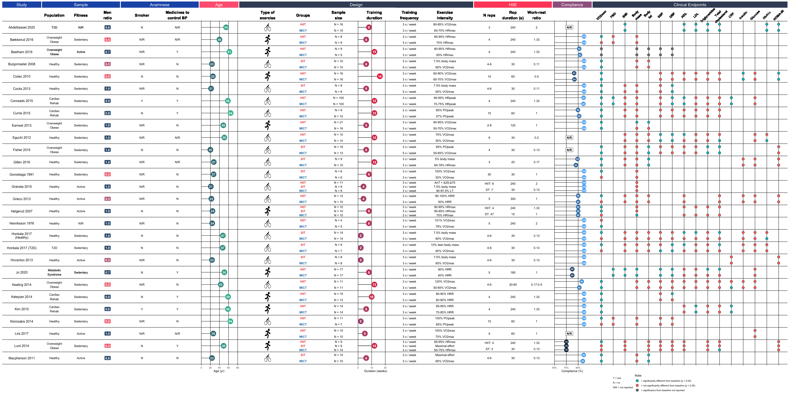

  
```{r, include = FALSE}
knitr::opts_chunk$set(
  collapse = TRUE,
  comment = "#>",
  message = FALSE,
  warning = FALSE,
  dpi = 300,
  fig.width = 8,
  fig.height = 6,
  fig.align = "center"
)
```

I first found out about the GOfER diagram (Graphical Overview for Evidence Reviews) in this tweet from [Will Stahl-Timmins](https://twitter.com/will_s_t):

<blockquote class="twitter-tweet" align="center"><p lang="en" dir="ltr">The BMJ&#39;s first ever GOfER diagram (Graphical Overview for Evidence Reviews) today, in this systematic review of the effects of eating breakfast on weight loss: <a href="https://t.co/OlHIQ5mtwd">https://t.co/OlHIQ5mtwd</a> <a href="https://twitter.com/hashtag/BMJInfographic?src=hash&amp;ref_src=twsrc%5Etfw">#BMJInfographic</a> <a href="https://t.co/3jIDvEYOAJ">pic.twitter.com/3jIDvEYOAJ</a></p>&mdash; Will Stahl-Timmins (@will_s_t) <a href="https://twitter.com/will_s_t/status/1090937361251385344?ref_src=twsrc%5Etfw">January 31, 2019</a></blockquote> <script async src="https://platform.twitter.com/widgets.js" charset="utf-8"></script>

I was quite impressed with this diagram. It was the perfect replacement for the rather boring "Table 1" in meta-analyses. So I decided that I wanted to have something similar to my meta-analysis paper. Because, why not? A little bit of googling got me to this [website](http://blogs.exeter.ac.uk/gofer/). This is the software that Will developed from his thesis. The software is quite nice and with a quick read in its manual, you have your first GOfER. There was one problem for me, though. I had a rather large amount of data, and the software doesn't support copy and pasting functionality. Therefore, if I had to add or change things around it was a quite tedious work. Therefore, I contacted Will to check whether I could understand a little better how the data is handle by the software in the background. I wanted to develop a way I could prepare the data in **R** and then perhaps exported it as a **.json** file and voilá!

In the meantime I was writing Will (it was around December of 2019), [Thomas Lin Pedersen](https://twitter.com/thomasp85) was preparing a CRAN release for the awesome [{patchwork}](https://patchwork.data-imaginist.com/) R package. When I saw [this vignette](https://patchwork.data-imaginist.com/articles/guides/layout.html#cb9) was when I realized: **I can make a GOfER entirely in R using ggplot2 and patchwork!!!!** This layout functionality was the perfect feature that I needed to make it work the way I thought it could be done!

After two days of work, this is the result that you now see in the paper:

{ width=100% }

```{block, type = 'rmdinfo'}
You can of course read the source code to check how it is done, but I am going to also walk you through here to explain a little better, so you can also build one if you want.
```

## Steps to build a GOfER

### 1) Prepare your data

Please, take a look at `metabolic_gofer` to see the data structure being used in to build the GOfER.

Your first step should be to define in how many pages you want to display your information, given the amount of details from each study you want to provide. For this vignette, we are going to make an example with **10 studies**, but our original GOfER had **28 studies** in one page. Therefore, the first step is to filter these data.

```{r}
library(metabolic)

data_gofer <- metabolic_gofer %>% 
  ## arrange study and groups to show in the correct order in the graph
  dplyr::arrange(dplyr::desc(study), dplyr::desc(groups)) %>%
  dplyr::mutate(study = forcats::as_factor(study)) %>%
  tidyr::nest_legacy(-study) %>% 
  ## get the first 10 studies
  tail(10)

## here we get the number of studies + 1 to show the lines in the graph
## since we have 10 studies, this is simply 10 + 1
n_lines <- 10 + 1

print(data_gofer, n = Inf)
```

### Before we begin plotting...

I am going to set a new `ggplot2` theme. Here we are setting common settings for a theme that we are going to use in every plot. Some settings differ depending if the plot has only text or if there is line plot, for example.

```{r}
library(ggplot2)
library(patchwork)
```

```{r}
theme_gofer <- function(strip_background = "#1f58b5", margins = c(0, 0, 0, 0), line_plot = FALSE) {
  if(line_plot) {
    theme_light() +
      theme(
        panel.grid.major = element_line(size = 0.5, linetype = 'solid', colour = "black"),
        panel.grid.minor = element_blank(),
        axis.text.y = element_text(size = 8),
        panel.background = element_blank(),
        panel.border = element_blank(),
        plot.background = element_blank(),
        plot.margin = unit(margins, "cm"),
        axis.title.y = element_blank(),
        strip.background = element_rect(fill = strip_background),
        strip.text = element_text(size = 15, colour = "white"),
        legend.position = "none"
      )
  } else {
    theme_light() +
      theme(
        panel.background = element_blank(),
        panel.border = element_blank(),
        panel.grid = element_blank(),
        plot.background = element_blank(),
        plot.margin = unit(margins, "cm"),
        axis.title = element_blank(),
        axis.text = element_blank(),
        axis.ticks = element_blank(),
        strip.background = element_rect(fill = strip_background),
        strip.text = element_text(size = 15, colour = "white"),
        legend.position = "none"
      )
  }
}
```

### 2) Build the lines to separate the studies - the basic grid plot

For the plot, the first step is to build the basic grid, which is the lines that will separate each study.

```{r}
p_grid <- data_gofer %>% 
  # this is a hack to show a white space between the facet and the plot
  # this is needed to be able to have subheadings
  dplyr::add_row(study = NA) %>%
  ggplot() +
  ## here although we do not plot the study labels yet, this is needed to ensure
  ## that plots will be aligned across panels since they always share the same x-axis (study)
  ggfittext::geom_fit_text(aes(x = study, y = 0, label = ""),
                           place = "left",
                           reflow = TRUE,
                           fontface = "plain",
                           position = position_dodge(width = 0.7),
                           show.legend = FALSE,
                           na.rm = TRUE) +
  geom_vline(xintercept = seq(1, n_lines, 1)  - 0.5) +
  theme_void() +
  coord_flip()

p_grid
```

### 3) Study panel

Here is when the studies (Author and Year) are plotted. Also, the colorful headers at the top will be created with `ggplot2::facet_wrap()`.

```{r}
p_studies <- data_gofer %>%
  # this is a hack to show a white space between the facet and the plot
  # this is needed to be able to have subheadings
  dplyr::add_row(study = NA) %>%
  ggplot() +
  ggfittext::geom_fit_text(aes(x = study, y = 0, label = study),
                           place = "centre",
                           reflow = TRUE,
                           fontface = "plain",
                           show.legend = FALSE,
                           na.rm = TRUE) +
  coord_flip() +
  facet_wrap(~ "Study") +
  theme_gofer()

p_studies
```

```{block, type = 'rmdwarning'}
<br>
Current GOfER state - Control layout with `patchwork`
```

```{r}
layout <- c(
  area(t = 1, l = 1, b = 3, r = 2), # p_grid (the `r` argument will be adjusted as we go.. it controls the width of the plot)
  area(t = 1, l = 1, b = 3, r = 1) # p_studies
)

p_grid +
  p_studies +
  plot_layout(nrow = 1, design = layout)
```

### 4) Sample panel

Here we plot general characteristics from the sample of each study, such as **population**, **fitness**, and **men ratio**.

#### Data preparation

Here some data preparation is needed to define color of labels and y-axis placement.

```{r}
## data preparation
data_sample <- data_gofer %>%
  tidyr::unnest_legacy() %>%
  dplyr::select(study, dplyr::starts_with("sample")) %>%
  dplyr::mutate(sample_men_ratio = round(sample_men_ratio, digits = 1),
                fill = dplyr::case_when(
                  sample_men_ratio > 0.5 ~ "#355c7d",
                  sample_men_ratio == 0.5 ~ "#c06c84",
                  sample_men_ratio < 0.5 ~ "#f67280"
                ),
                sample_men_ratio = sprintf(sample_men_ratio, fmt = '%#.1f')) %>%
  dplyr::distinct_all() %>%
  dplyr::arrange(dplyr::desc(study)) %>%
  # this is a hack to show a white space between the facet and the plot
  # this is needed to be able to have subheadings
  dplyr::add_row(study = NA) %>%
  dplyr::mutate(
    dummy_population = 0.5,
    dummy_fitness = 2,
    dummy_men_ratio = 3.5
  )

data_sample
```

```{r}
p_sample <- data_sample %>% 
  ggplot() +
  ## Population
  geom_text(aes(x = study, y = dummy_population, label = sample_population),
                     fontface = "plain",
                     show.legend = FALSE,
                     na.rm = TRUE) +
  ## Population subheading
  geom_text(aes(x = NA, y = dummy_population),
                     label = "Population",
                     size = 5,
                     fontface = "bold",
                     show.legend = FALSE,
                     na.rm = TRUE) +
  ## Fitness
  geom_text(aes(x = study, y = dummy_fitness, label = sample_fitness),
                     fontface = "plain",
                     show.legend = FALSE,
                     na.rm = TRUE) +
  ## Fitness subheading
  geom_text(aes(x = NA, y = dummy_fitness),
                     label = "Fitness",
                     size = 5,
                     fontface = "bold",
                     show.legend = FALSE,
                     na.rm = TRUE) +
  ## Men Ratio
  geom_label(aes(x = study, y = dummy_men_ratio, label = sample_men_ratio, fill = fill),
                      colour = "white",
                      size = 4,
                      fontface = "bold",
                      na.rm = TRUE) +
  ## Men Ratio subheading
  geom_text(aes(x = NA, y = dummy_men_ratio),
                     label = "Men\nratio",
                     size = 5,
                     fontface = "bold",
                     show.legend = FALSE,
                     na.rm = TRUE) +
  coord_flip() +
  scale_fill_identity() +
  ## the following will ensure that there is some extra space at the beginning and at the end
  ylim(0, 4) +
  facet_wrap(~ "Sample") +
  theme_gofer()

p_sample
```

```{block, type = 'rmdwarning'}
<br>
Current GOfER state - Control layout with `patchwork`
```

```{r}
layout <- c(
  area(t = 1, l = 1, b = 3, r = 3), # p_grid (the `r` argument will be adjusted as we go.. it controls the width of the plot)
  area(t = 1, l = 1, b = 3, r = 1), # p_studies
  area(t = 1, l = 2, b = 3, r = 3)  # p_sample
)

p_grid +
  p_studies +
  p_sample +
  plot_layout(nrow = 1, design = layout)
```

### 5) Anamnese panel

Here we plot information on whether participants in the studies were **smokers** and were taking **medicines to control blood pressure**.

```{r}
## data preparation
data_anamnese <- data_gofer %>%
  tidyr::unnest_legacy() %>%
  dplyr::select(study, dplyr::starts_with("anamnese")) %>%
  # this is a hack to show a white space between the facet and the plot
  # this is needed to be able to have subheadings
  dplyr::add_row(study = NA) %>%
  dplyr::mutate(
    dummy_smoker = 1,
    dummy_medicines = 2
  ) %>%
  dplyr::distinct_all()

data_anamnese
```

```{r}
p_anamnese <- data_anamnese %>%
  ggplot() +
  geom_text(aes(x = study, y = dummy_smoker, label = anamnese_smoker),
                     fontface = "plain",
                     position = position_dodge2(width = 1),
                     show.legend = FALSE,
                     na.rm = TRUE) +
  geom_text(aes(x = NA, y = dummy_smoker),
                     label = "Smoker",
                     size = 5,
                     fontface = "bold",
                     show.legend = FALSE,
                     na.rm = TRUE) +
  geom_text(aes(x = study, y = dummy_medicines, label = anamnese_medicines_to_control_BP),
                     fontface = "plain",
                     position = position_dodge2(width = 1),
                     show.legend = FALSE,
                     na.rm = TRUE) +
  geom_text(aes(x = NA, y = dummy_medicines),
                     label = "Medicines to\ncontrol BP",
                     size = 5,
                     fontface = "bold",
                     show.legend = FALSE,
                     na.rm = TRUE) +
  coord_flip() +
  ylim(0.5, 2.5) +
  facet_wrap(~ "Anamnese") +
  theme_gofer()

p_anamnese
```

```{block, type = 'rmdwarning'}
<br>
Current GOfER state - Control layout with `patchwork`
```

```{r fig.width=10}
layout <- c(
  area(t = 1, l = 1, b = 3, r = 5), # p_grid (the `r` argument will be adjusted as we go.. it controls the width of the plot)
  area(t = 1, l = 1, b = 3, r = 1), # p_studies
  area(t = 1, l = 2, b = 3, r = 3),  # p_sample
  area(t = 1, l = 4, b = 3, r = 5) # p_anamnese
)

p_grid +
  p_studies +
  p_sample +
  p_anamnese +
  plot_layout(nrow = 1, design = layout)
```

In panels like **Anamnese** you might also want to display a **legend** for acronyms used. You may want to explicitly tell the reader that:

```{block, type = 'rmdinfo'}
Y = Yes <br>
N = No <br>
N/R = Not Reported
```

Therefore, the easiest way of achieving this is to create a "helper plot", which we are going to use only its legends. Placing a legend in your GOfER is done following these steps:

1. Create the helper plot
1. When combining the plots with `patchwork`, plot the helper plot first, so it will get hidden by the others.
1. Use the `guides = "keep"` argument in `patchwork::plot_layout`.

### 5.1) Creating the helper plot

```{r}
## create some data
data_caption_label <- dplyr::tibble(
  x = 1:3,
  y = 1:3,
  caption_label = c("Y = yes", "N = no", "N/R = not reported")
) %>%
  dplyr::mutate(caption_label = forcats::as_factor(caption_label))
```

#### Basic plot

```{r}
data_caption_label %>% 
  ggplot() +
  geom_point(aes(x = x, y = y, shape = caption_label))
```

#### Final plot

```{r}
p_caption <- data_caption_label %>% 
  ggplot() +
  geom_point(aes(x = x, y = y, shape = caption_label)) +
  geom_rect(aes(xmin = -Inf, xmax = Inf, ymin = -Inf, ymax = Inf), fill = "white") +
  theme_void() +
  labs(shape = "Note:")+
  theme(legend.position = "bottom",
                 legend.direction = "vertical") +
  guides(shape = guide_legend(override.aes = list(shape='')))

p_caption
```

### 5.2) Combine it with `patchwork`

```{r fig.width=10, fig.height=8}
layout <- c(
  area(t = 1, l = 4, b = 3, r = 5), # p_caption (here you choose where to place the legend, since it is under anamnese in this example, we use `l = 4` and `r = 5`)
  area(t = 1, l = 1, b = 3, r = 5), # p_grid (the `r` argument will be adjusted as we go.. it controls the width of the plot)
  area(t = 1, l = 1, b = 3, r = 1), # p_studies
  area(t = 1, l = 2, b = 3, r = 3),  # p_sample
  area(t = 1, l = 4, b = 3, r = 5) # p_anamnese
)

## now plot `p_caption` first
p_caption +
  p_grid +
  p_studies +
  p_sample +
  p_anamnese +
  plot_layout(nrow = 1, design = layout, guides = "keep")
```

### 6) Age panel

Here we plot the median from the reported **age** of the groups in each study.

```{r}
## data preparation
data_age <- data_gofer %>%
  tidyr::unnest_legacy() %>%
  dplyr::select(study, groups, age) %>%
  dplyr::group_by(study) %>%
  dplyr::summarise(age_median = stats::median(age)) %>%
  # this is a hack to show a white space between the facet and the plot
  # this is needed to be able to have subheadings
  dplyr::add_row(study = NA)

data_age
```

```{r}
p_age <- data_age %>%
  ggplot(aes(x = study, y = age_median, colour = age_median, label = as.integer(age_median))) +
  geom_segment(aes(x = study, y = 0, xend = study, yend = age_median), colour = "black", na.rm = TRUE) +
  geom_point(size = 9, na.rm = TRUE) +
  geom_text(color = "white", size = 4, fontface = "bold", na.rm = TRUE) +
  ## Hack to delete lines above
  geom_rect(aes(xmin = n_lines - 0.45, xmax = Inf, ymin = -Inf, ymax = Inf), fill = "white", colour = "white") +
  scale_color_gradient(low = "#3a6e7f", high = "#38c2a4") +
  coord_flip() +
  scale_x_discrete(breaks = NULL) +
  ylim(0, 70) +
  labs(y = "Age (yr)") +
  facet_wrap(~ "Age") +
  theme_gofer(strip_background = "#ff6581", margins = c(0, 0, 0, 0.1), line_plot = TRUE)

p_age
```

```{block, type = 'rmdwarning'}
<br>
Current GOfER state - Control layout with `patchwork`
```

```{r fig.width=10, fig.height=8}
layout <- c(
  area(t = 1, l = 4, b = 3, r = 5), # p_caption (here you choose where to place the legend, since it is under anamnese in this example, we use `l = 4` and `r = 5`)
  area(t = 1, l = 1, b = 3, r = 6), # p_grid (the `r` argument will be adjusted as we go.. it controls the width of the plot)
  area(t = 1, l = 1, b = 3, r = 1), # p_studies
  area(t = 1, l = 2, b = 3, r = 3), # p_sample
  area(t = 1, l = 4, b = 3, r = 5), # p_anamnese
  area(t = 1, l = 6, b = 3, r = 6)  # p _age
)

p_caption +
  p_grid +
  p_studies +
  p_sample +
  p_anamnese +
  p_age +
  plot_layout(nrow = 1, design = layout, guides = "keep")
```

---

### Final notes

I guess by now you could have a good idea of the thought behind building a **GOfER** with **ggplot2** and **patchwork**. I hope this little tutorial can encourage others conducting a meta-analysis to build something similar for their own data. It certainly looks better than having this information in a table!

Last, but not least, I would like to express my gratitude to **Will Stahl-Timmins** for being such a great inspiration that led me to buillding a GOfER in R, and to **Thomas Lin Pedersen** and **Hadley Wickham** for building the fantastic **patchwork** and **ggplot2** that made this possible!
